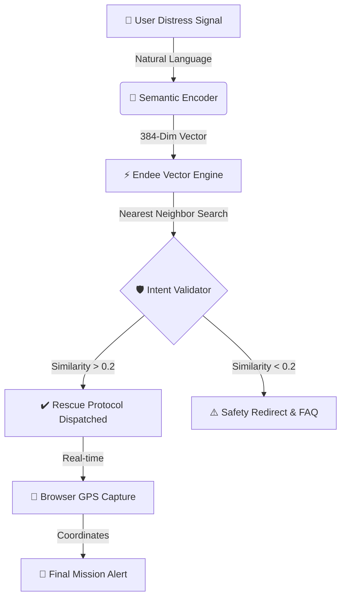

# 🚨 Emergency SOS Chatbot: Global Relief Mission 🌍

## 🚑 Project Overview
In the wake of a disaster, every second counts. The **Emergency SOS Chatbot** is a next-generation command center designed to bridge the critical gap between human distress and technical logistics. 

This system specializes in **Unstructured-to-Structured Relief Coordination**. It transforms raw, high-stress distress messages into precise, actionable dispatch protocols. By utilizing advanced semantic search, the AI identifies exactly which rescue teams, medical supplies, or specialized gear are needed for the unique crisis described by the victim.

---

## 🏗️ System Design & Architecture
The application is built on a resilient, modular architecture designed for high-availability during crisis situations.

### 🔄 The Relief Lifecycle


### 🛠️ Technical Ecosystem
*   **Frontend Component**: `Streamlit` — A reactive, high-performance UI for mission control.
*   **Vector Engine**: `Endee` — C++ powered core for sub-millisecond similarity lookups.
*   **Intelligence Layer**: `all-MiniLM-L6-v2` — High-efficiency sentence transformers for deep semantic understanding.
*   **Infrastructure**: `Docker & Docker Compose` — Container-native isolation for rapid deployment.
*   **Geolocation**: `Streamlit-Geolocation` — W3C Standard GPS integration for precise coordinate tracking.

---

## ⚡ Powering the Core: Use of Endee Vector Database
At the heart of every rescue mission is the **Endee Vector Database**. Endee provides the backbone for the system's rapid response capabilities through:

*   **🔒 Local Sovereignty**: Endee runs entirely within the local environment, ensuring maximum data privacy and full operational capacity during network blackouts.
*   **🚀 C++ Performance**: Built with a C++ core, Endee delivers sub-millisecond retrieval times, which is essential during the "Golden Hour" of emergency response.
*   **📦 Containerized Isolation**: Running on **Port 8081**, the Endee instance is perfectly isolated from host conflicts, providing a stable, dedicated search engine.
*   **✨ Dynamic Seeding**: The system supports instant indexing, allowing the crisis knowledge base to be updated in real-time as new protocols emerge.

---

## 🚀 Deployment & Setup Guide

### 📋 1. Prerequisites
Before launching the mission control, ensure you have:
*   🐳 **Docker Desktop** (Operational and running)
*   🐍 **Python 3.10+** (System environment ready)
*   🌐 **Modern Browser** (For GPS and UI features)

### 🛠️ 2. Infrastructure Initialization
Initialize the localized Endee engine. This command builds the build-context and establishes the persistent data volume:
```bash
docker-compose up -d --build
```

### 📦 3. Application Dependencies
Install the required intelligence and UI libraries:
```bash
pip install -r requirements.txt
```

### 🧬 4. Knowledge Base Seeding
Populate the Endee index with our 15 specialized crisis scenarios:
```bash
python app/database.py
```

### 🚨 5. Launch Mission Control
Start the interactive emergency textline:
```bash
streamlit run app/app.py
```
*Access your command center at: [http://localhost:8501](http://localhost:8501)*

---

## 🩹 Troubleshooting & Resources
*   **⚠️ Port Conflicts**: If port 8081 is busy, adjust the `ports` mapping in `docker-compose.yml`.
*   **🔌 Connection Error**: Ensure the Endee Docker container is `Up (healthy)`. The app requires a direct link to the vector engine.
*   **🧭 Geolocation**: If GPS fails, ensure your browser has "Location Services" enabled and you are accessing via `localhost`.

---
*Dedicated to rapid response and humanitarian tech innovation.*
